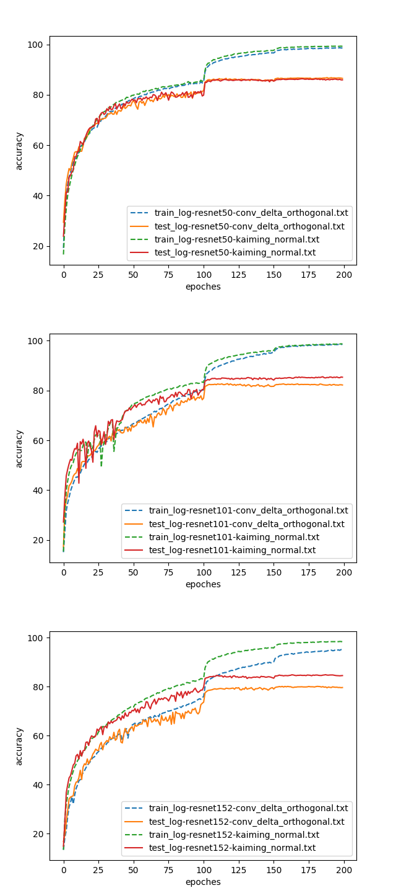

# Conv Delta Othogonal Initializer
A PyTorch implementation of [Dynamical Isometry and a Mean Field Theory of CNNs:
How to Train 10,000-Layer Vanilla Convolutional Neural Networks](https://arxiv.org/pdf/1806.05393.pdf)

## Usage
1. Install [PyTorch](http://pytorch.org/)

2. Start training (default: Cifar-10)
```bash
python train.py
```

3. Visualize the learning curve
```bash
python tools/plot.py log-xxx.txt log-yyy.txt
```

## Resnet on Cifar-10

We conducted experiments on Resnet-50, 101, 152.
To adapt to the initilizer, we modify the block expansion of resnet from 4 to 1,
such that `out_channels` is always not smaller than `in_channels`.

The learning rate is initialized with `0.1`, divided by 10 at epoch 100 and 150 and terminated at epoch 200.



## Reference
More discussion can be found at [Reddit](https://www.reddit.com/r/MachineLearning/comments/8r7fl2/r_how_to_train_10000layer_vanilla_convolutional/).
It seems that currently the theory applies on Vanilla CNN with tanh activations.
Skip-connection with ReLU activations or other modern architectures is still an open problem.
